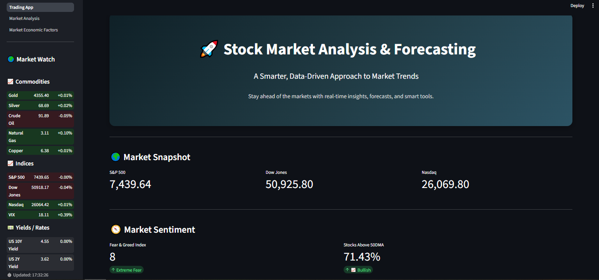
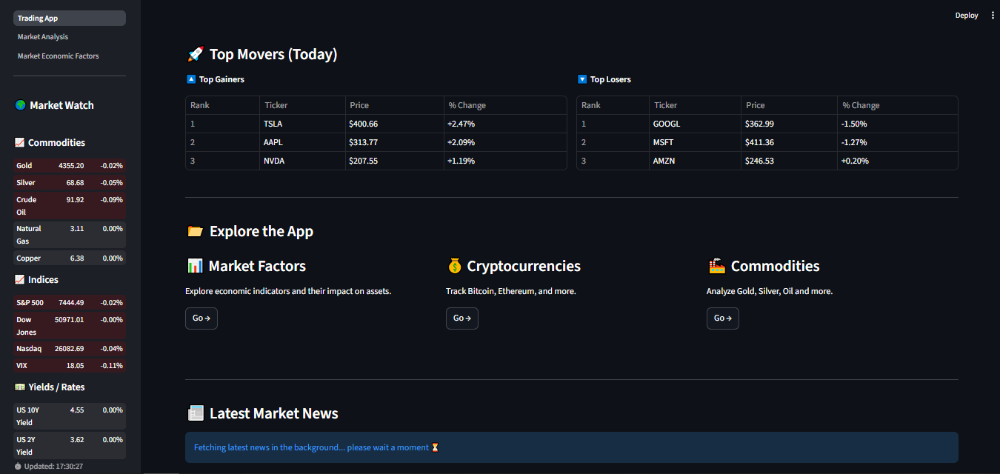
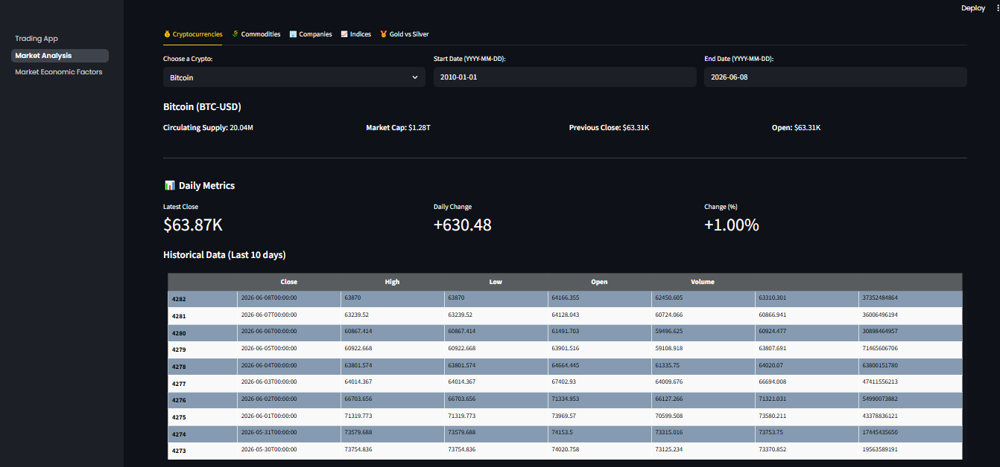
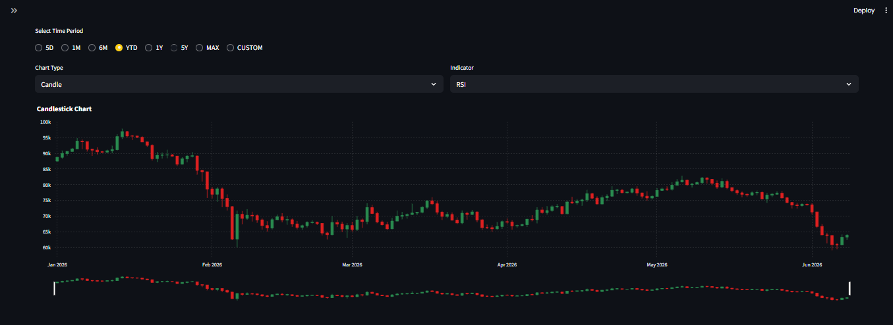
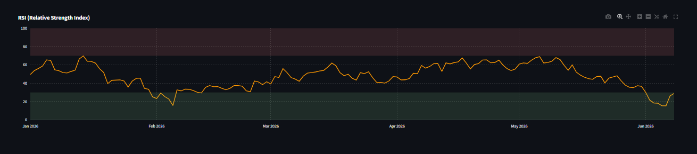
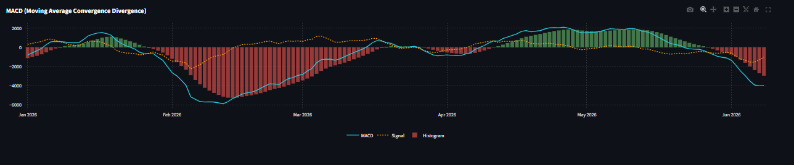
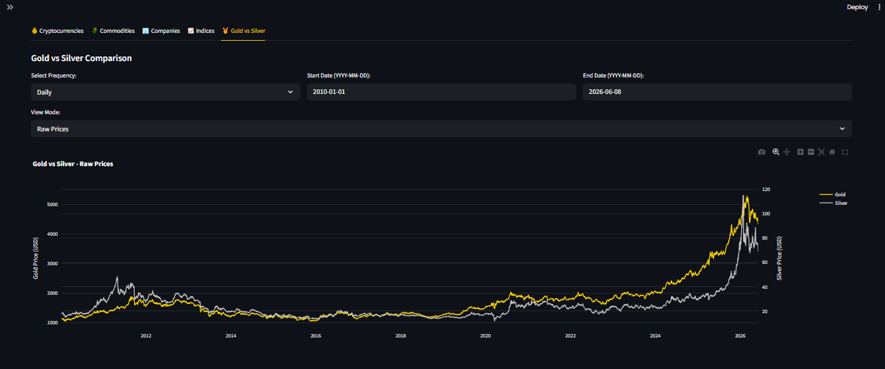
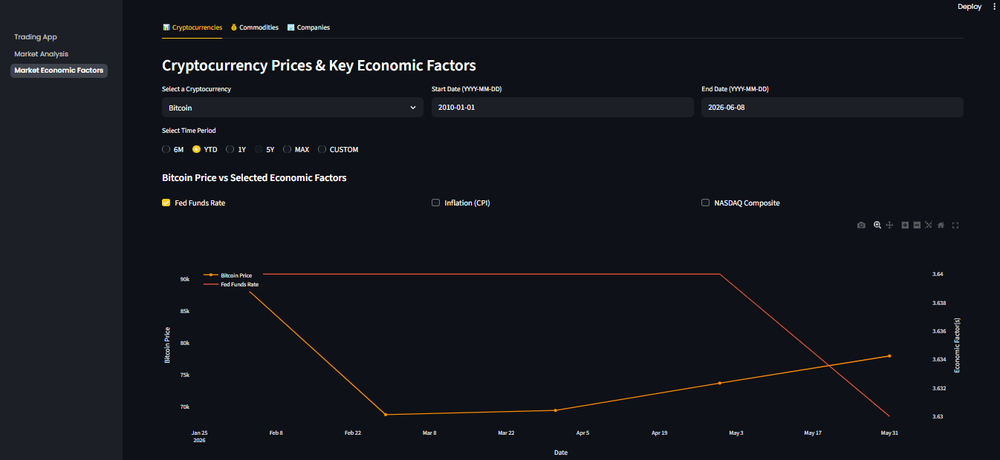
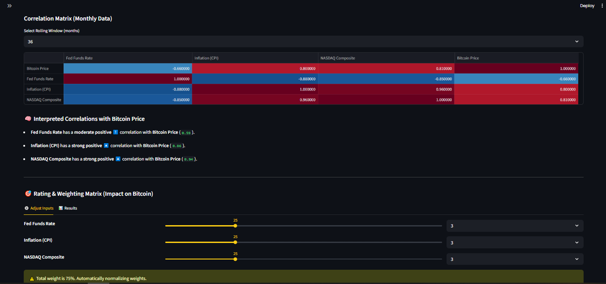

# 📈 Stock Market Analysis & Forecasting Platform

## Overview

An interactive financial analytics platform built with **Python** and **Streamlit** that combines market data, economic indicators, technical analysis, and forecasting tools into a unified dashboard for investors and analysts.

 # 🚀 Features

### 📊 Market Dashboard

* Live market watch with real-time updates
* Market snapshots and sentiment indicators
* Top market movers analysis
* Latest market news integration

### 📉 Market Analysis Module

* Technical indicators and chart analysis
* Candlestick visualizations
* Historical price analysis
* RSI and momentum indicators
* Multiple asset categories support

### 🌍 Economic Factors Analysis

* Commodity price analysis against macroeconomic indicators
* Economic data integration using FRED API
* Rolling correlation matrix analysis
* Commodity vs economic factor comparison
* Weighted impact scoring system

### 🥇 Precious Metals Analysis

* Gold vs Silver comparison
* Relative performance analysis
* Historical relationship tracking

## 🛠 Technologies Used

* Python
* Streamlit
* Pandas
* NumPy
* Plotly
* Yahoo Finance (yFinance API)
* FRED API

## 📌 Key Functionalities

✅ Interactive Financial Dashboard

✅ Live Market Monitoring

✅ Correlation Analysis

✅ Technical Indicators

✅ Economic Data Integration

✅ Weighted Scoring Models

✅ Historical Analysis

✅ Interactive Visualizations

## 📊 Skills Demonstrated

* Financial Data Analysis
* Business Intelligence
* Dashboard Development
* Data Visualization
* API Integration
* Statistical Analysis
* Python Programming
* Problem Solving

## 📷 Application Preview

### 📊 Market Dashboard

### 📉 Market Analysis

### 🌍 Economic Factors

## 👩‍💻 Author

**Kashaf Naz**

Data Analyst | Business Intelligence | Power BI | SQL | Python
